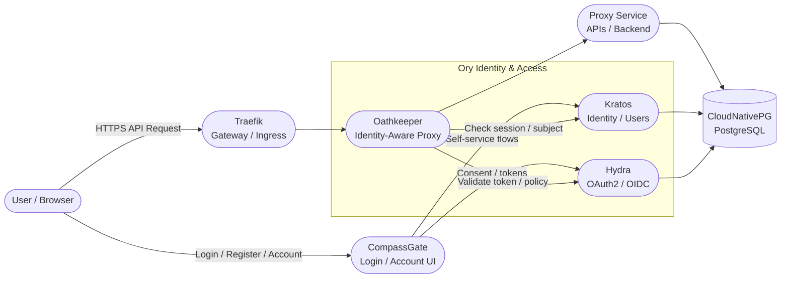

# 🧭 Compass Ops

> **Proof of Concept — Early Stage**
> Let me know if you find this useful or have suggestions [on the issues page](https://github.com/rescommunes/compass-ops/issues/new).

Compass Ops is an opinionated starter template for building modern cloud-native services.

It exists because I kept rebuilding the same infrastructure for every new service or experiment — Kubernetes, TLS, identity, secrets, routing, a Postgres cluster, observability, all wired together cleanly.

The broader concept behind this project includes the ability to bridge development workflows with real production‑style environments, and future versions of this template may evolve in that direction over time.

I believe there is significant value in having a development environment that runs entirely on a developer’s own machine while still closely mirroring (though not fully replicating) staging and production environments. This enables rapid iteration, safer experimentation, and immediate feedback without relying on shared infrastructure. 

## Current Architecture




## ⚙️ Stack Overview

compass-ops provides a **ready-to-use foundation** built around a modern, secure, service-oriented stack:

- [x] SOPs for security managing your configuration secrets
  
  - [x] PGP
  - [ ] Google KMS
  - [ ] AWS KMS
  - [ ] Azure KMS
  
- [x] **Kubernetes (Minikube, Cloud Ready)** — container orchestration and environment isolation

  - [x] Dev environment

    Proxy local development 

    > **Proxy Access** forwards cluster traffic to your local service via the `minikube tunnel`. Your service reaches cluster dependencies through the tunnel using host-accessible endpoints (e.g., `$(minikube ip):PORT`) instead of internal cluster DNS. This keeps the dev and cloud configurations close, with only minor differences in how service endpoints are addressed.
    
    * [x] HTTP
    * [ ] Web sockets
  
  - [ ] Examples of container integration 

  - [ ] Hosting in cloud environment

- [x] **Helmfile** — consistent, declarative provisioning across environments  

- [x] **Traefik** — secure gateway and routing  

- [x] **Cert-Manager** — automated TLS for both ingress and internal service-to-service communication
   - [x] Route53 (AWS)
   - [ ] CloudFlare
   - [ ] Cloud DNS (Google)
   
- [x] **CloudNativePG** — high-availability PostgreSQL for structured data and state

   - [ ] Proxy local development database access

- [ ] **Ory Kratos / Oathkeeper** — identity, authentication, and policy-based access control

- [ ] Simple Container Deployment

- [ ] **Ory  Hydra**

- [ ] **Prometheus / Grafana / Loki** — observability stack for metrics, logs, and tracing  

- [ ] **Async Worker Stack** — background processing and queue management  

## 🔒 Design Philosophy

- **Opinionated by design:**  decisions are made to help developers move fast with proven defaults.  
- **Security-first:** internal services communicate over TLS; secrets and policies are enforced by default.  
- **Service-oriented:** designed to encourage modular, loosely coupled service boundaries.  
- **Observable:** instrumentation hooks and metrics built in from the start.  
- **Developer velocity:** spin up isolated environments locally or in the cloud with minimal setup.  
- **Extensible foundation:** intended as a clean base for new REST APIs or experimental services.

This project isn’t meant to be revolutionary — just **useful**.  
If you want to start developing with solid foundations and good security defaults, compass-ops is here to save time and headaches.

## 🚀 Development Setup

⚠️ There is a requirement that you have a domain name to set this up.

### Get this source

If you want to update with your own project you should manage this repo by forking it into your own version control environment.   

<iframe src="https://ghbtns.com/github-btn.html?user=rescommunes&repo=compass-ops&type=fork" frameborder="0" scrolling="0" width="150" height="20" title="Github"></iframe>

> If you want to commit your secrets to your own repo then in `.gitIgnore` remove the entries `env/**/secrets.sops.yaml` and`env/**/values.yaml`.
>
> ```ini
> ## ignore the sops encrypted secrets files in env folder
> env/**/secrets.sops.yaml
> 
> ## ignore the values.yaml file in the env folders
> env/**/values.yaml
> ```

### Software Dependencies

Install the following applications

> A goal of the project is to support the latest version of these core offerings.  

* [Helm](https://helm.sh/docs/intro/install/) v4.0 
* [Helmfile](https://github.com/helmfile/helmfile/releases) v1.2
* [Minikube](https://minikube.sigs.k8s.io/docs/) v1.37

* I recommend `docker` as the driver to install minikube with 
  * Docker Desktop on [Mac](https://docs.docker.com/desktop/setup/install/mac-install/), [Linux](https://docs.docker.com/desktop/setup/install/linux/), or [Windows](https://docs.docker.com/desktop/setup/install/windows-install/)

* [kubectl](https://kubernetes.io/docs/tasks/tools/) v1.34 
* [SOPS](https://github.com/getsops/sops)  v3.11

#### Recommended: helmfile secrets add on

This extension manages the decryption of the secretes when syncing them with your projects.

> 📝 See [jkroepke/helm-secrets](https://github.com/jkroepke/helm-secrets/wiki/Installation) 

1. `helm plugin install https://github.com/jkroepke/helm-secrets/releases/download/v4.7.4/secrets-4.7.4.tgz --verify=false`
2. `helm plugin install https://github.com/jkroepke/helm-secrets/releases/download/v4.7.4/secrets-getter-4.7.4.tgz --verify=false` 

3. `helm plugin install https://github.com/jkroepke/helm-secrets/releases/download/v4.7.4/secrets-post-renderer-4.7.4.tgz --verify=false`

### DNS Configuration

Create the following DNS records with your DNS provider

```txt
dev.example.com.  IN  A   127.0.0.1
*.dev.example.com.  IN  CNAME   dev.example.com.
```

These two records make every hostname under dev.example.com resolve to your local machine.

### SOPS: Secrets OPerationS

1. Configure your **PGP** keys 
   (or view the [documentation](https://github.com/getsops/sops?tab=readme-ov-file#sops-secrets-operations) for [other kinds of keys](https://github.com/getsops/sops?tab=readme-ov-file#sops-secrets-operations))

2. Configure your SOPS settings (.sops.yaml). 

   ```yaml
   creation_rules:
     - path_regex: secrets\.sops\.yaml$
       pgp: "YOUR-PGP-FINGERPRINT"
     - path_regex: local\.secrets\.yaml$
       pgp: "YOUR-PGP-FINGERPRINT"
   ```


### Start minikube

To get started with compass-ops locally, follow these steps:

> 📝  we are installing in a namespace `compass` if you would like to run additional minikube environments give them other namespace names.

```bash
minikube start -p compass --driver=docker --cpus=4 --memory=8192 --mount=true --mount-string="$HOME/dev-storage:/data"
```

The above command installs a minikube instance with `docker`  in the namespace `-p` `compass`, adjust `--cpus` and  `--memory` as you may need to. 

The `mount` options create a mountable drive for persistent database (etc) storage adjust `"$HOME/dev-storage:/data"` as you'd like in any normal file path (ie: not cloud synced or something).

```bash
minikube -p compass addons enable metrics-server
```

Adding **metrics-server** allows you to collect  and monitor resource usage metrics (such as CPU and memory) for your  Kubernetes clusters, aiding in resource management and optimization.

```bash
minikube -p compass addons enable dashboard
```

Adding **dashboard** allows you to use the Kubernetes web UI `minikube -p compass dashboard` 

To wrap up the Minikube setup, the **tunnel** command exposes LoadBalancer services by creating a local network tunnel. Because it forwards privileged ports such as 80 and 443, you’ll need to run it with superuser privileges.

```bash
sudo minikube tunnel -p compass
```

### Initial Compass Configuration

You need to tell compass a few things about your own environment. 

#### Value Configs

copy `env/dev/values.example.yaml` to `env/dev/values.yaml`

```yaml
env:
  domain: example.com
  email: sam@example.com
  certificate:
    tlsWildCardSecretName: dev-wildcard-tls
    clusterIssuer: letsencrypt-staging
  dns:
    dnsProvider: route53
    secretName: dns-credentials
    region: us-east-1
    zoneID: 1234ABCD
    accessKeyID: ABCD1234
```

Update the `env` sections for `domain`, `email`  (used for lets encrypt registration)

You can change **`certificate.clusterIssuer`** to `letsencrypt-prod` once your setup is stable and you’re no longer requesting certificates frequently. Use `letsencrypt-staging` during setup to avoid rate limits—staging certs must be manually accepted like self-signed ones.  

Switch to `letsencrypt-prod` only when DNS and routing are correct, as production certificates are trusted by system CAs (browsers, OS trust stores, Python/Go/Node runtimes, etc.) and require no manual approval.

> * [ ] To do: explain how to find the values on dns providers 

The `values.example.yaml` file has examples of how to fill out you chosen dns provider. 

#### Secret Configs

copy the file ``env/dev/secrets.example.yaml` to `env/dev/local.secrets.yaml`

```yaml
env:
  secrets:
    route53:
    	accessKey: shhh
```

> * [ ] To do: explain how to find the values on dns providers 

The `secrets.example.yaml` file has examples of how to fill out you chosen dns provider. 

run this command to encrypt the file ` sh ./bin/secrets.sh dev encrypt`
To decrypt the file for editing run  `sh ./bin/secrets.sh dev decrypt`

#### Proxy Configs

For an http application served on your host ip. This is only loaded in the dev environment; production does not use proxy.values.yaml.

Edit `env/dev/proxy.values.yaml`  And update the `port` and `hostIP`

#### Run via Minikube

Any time you change the chart `repositories` be sure to update he dependencies for helm.

```bash
helmfile deps
```

Finally, build your Kubernetes environment
```bash
helmfile -e dev sync
```


## 🧩  Other Compass Projects

### [🛡️ Compass Gate](https://github.com/rescommunes/compass-gate)

**compass-gate** is the identity and access portal for compass-ops.  
It provides integrated authentication, authorization, and user management using **Ory Kratos**, **Hydra**, and **Oathkeeper**.

Together, **compass-ops** and **CompassGate** deliver a complete foundation for secure, production-ready service development:


- **compass-ops** handles orchestration, observability, and infrastructure setup.  
- **Compass Gate** manages identity, OAuth2 clients, and access control policies.  

If you’re deploying compass-ops, you’ll want to check out **Compass Gate** for end-to-end security integration.

